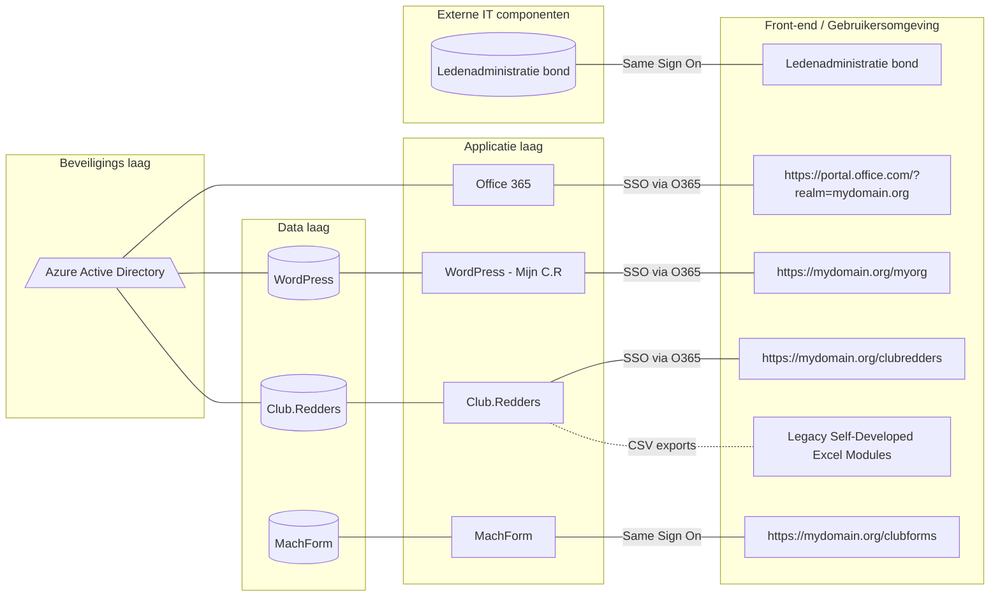
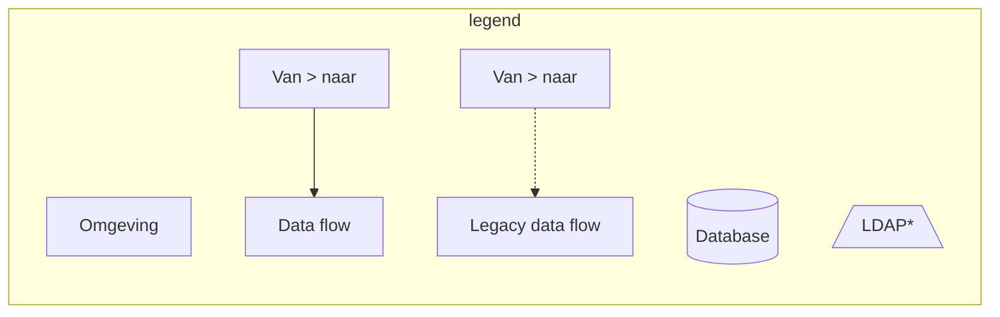

# Generaties

## Tool zonder externe afhankelijkheden met P-A-O releases

```mermaid
graph LR;
    subgraph Front-end / Gebruikersomgeving;
	d1[https://portal.office.com/?realm=mydomain.org];
    d2[https://mydomain.org/myorg];
    d3[https://mydomain.org/clubredders];
    d4[https://mydomain.org/clubforms];
	d5[Legacy Self-Developed Excel Modules];
	d6[Ledenadministratie bond];
    end;

    subgraph Applicatie laag;
    c1[Office 365];
	c2[WordPress - Mijn C.R];
    c3[Club.Redders];
    c4[MachForm];
    end;

    subgraph Data laag;
    b2[(WordPress)];
    b3[(Club.Redders)];
    b4[(MachForm)];
    end;

    subgraph Beveiligings laag;
    a1[/Azure Active Directory\];
    end;

    subgraph Externe IT componenten;
    e1[(Ledenadministratie bond)];
    end;

    e1 -- Same Sign On --- d6;
	c1 -- SSO via O365 --- d1;
    c2 -- SSO via O365 --- d2;
    c3 -- SSO via O365 --- d3;
    c4 -- Same Sign On --- d4;
    c3 -. CSV exports .- d5;

    b2 --- c2;
    b3 --- c3;
    b4 --- c4;

    a1 --- c1;
    a1 --- b2;
    a1 --- b3;
```
*) Identiteits- en toegangsbeheer database

```mermaid
graph LR;
    subgraph legend;
    z[Omgeving];
    y[(Database)];
    x[/LDAP*\];
    w[Van > naar] --> w2[Data flow];
    v[Van > naar] -.-> v2[Legacy data flow];
	end;
```