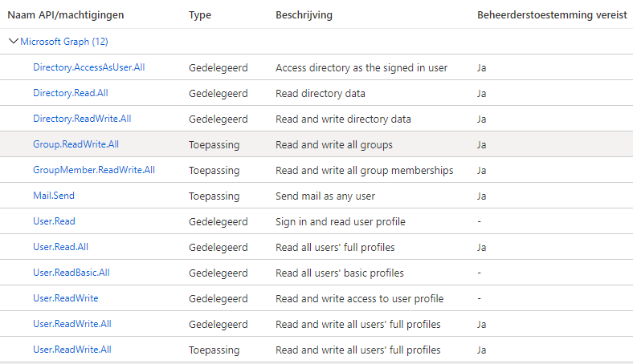

# Werkinstructie C.R installatie &amp; configuratie

## Uitgangspunten

Binnen de IT Suite voor non profits is voor Club.Redders gekozen als maatwerk pakket. C.R voorziet in alle maatwerk functionaliteiten welke niet door de overige standaard pakketen uit de suite worden gefaciliteerd. De enige standaard functionaliteit die C.R levert is een documentencentrum voor leden. Hierdoor is het mogelijk ook een statische site te kiezen als alternatief voor bijvoorbeeld WordPress.

In dit document is uitgegaan van het volgende;

- De Office 365 omgeving is ingericht volgens de werkinstructie Office 365 beheer.
- Club.Redders is geïnstalleerd en geconfigureerd volgens dit document.
- Binnen Office 365 zijn de applicatie groepen aangemaakt volgens dit document.
    - In tegenstelling tot de werkinstructie Office 365 beheer worden voor externe applicaties wél andere groepen aangemaakt dan z.g.n. Office 365 groepen, namelijk security groups. Deze worden aangemaakt vanuit;
        - Het beheercentrum – groepen;
            - Met een naam volgens de volgende naamconventie;
                - App\_ als indicatie voor externe rechten groepen.
                - &lt;NaamApplicatie&gt; naam van de externe applicatie.
                - &lt;NaamApplicatieRol&gt; naam van de rol in de applicatie.
              - Bijvoorbeeld: App\_ClubRedders\_Administrator voor de applicatie Club.Redders en de rol Administrator in die applicatie.
              - Als beschrijving kan worden gekozen om de officiële beschrijving van de rechtengroep toe te voegen uit de documentatie van de betreffende applicatie.
        - Na het aanmaken van de groep kan deze worden voorzien van eigenaren en leden. Zoals gesteld in de werkinstructie Office 365 beheer zijn Verder zijn de eigenaren van de Office 365 groepen zelf verantwoordelijk voor het op en afvoeren van gewijzigde (actieve) leden.
            - Voor de App\_ groepen wordt het beheer vooralsnog uitgevoerd door de IT functionarissen. Zij worden tot op heden ingesteld als eigenaar.
            - De leden worden toegevoegd en verwijderd op verzoek van het bestuur. Zie hiervoor ook de standaard toekenning onder gebruikersbeheer.

- Het SASL adres uit O365 kan indien gewenst worden ingesteld voor het verzenden van E-mail berichten vanuit Club.Redders (_[_noreply@domain.org_](mailto:noreply@domain.org)_).

## Gebruikersbeheer

Dit document houd de termen aan zoals gebruikt in de werkinstructie Office 365 beheer.

De volgende situaties zijn mogelijk bij het beheer van gebruikers;

- Instroom / nieuw lid.
    - Standaard krijgt een lid toegang tot de Mijn omgeving binnen Club.Redders.
- Doorstroom / lid krijgt, wijzigt of stopt met actieve functie.
      - Lid krijgt actieve functie.
 Het lid wordt toegevoegd of verwijderd uit de gewenste App\_ groep(en).
 Standaard wordt hiervoor nu gehanteerd;
        - Bestuur: App\_ClubRedders\_WP\_Editor
        - CieO: App\_ClubRedders\_WP\_Contributor
        - CSz: App\_ClubRedders\_WP\_Contributor
        - IT: App\_ClubRedders\_Administrator
        - n/a: App\_ClubRedders\_Member
- Uitstroom / lid meld zich af.
    - Na het disabelen of verwijderen van het account in O365 kan een lid zich niet meer aanmelden in Club.Redders.

### Attribute mapping vanuit Office 365.

De volgende attributen worden uitgewisseld tussen Club.Redders en Office 365;

- Login gegevens;
    - GivenName First Name
    - Surname Last Name
    - DisplayName Display name publicly as
    - UserPrincipalName Username/Nickname/Email
- Rollen
    - Alle rollen van de groepen waarvan de gebruiker lid is.

## Registreer Club.Redders als AAD applicatie

### Algemeen

1. Log als beheerder van de gewenste tenant/directory in op [portal.azure.com](https://portal.azure.com/).
2. Navigeer naar de [AAD](https://portal.azure.com/#blade/Microsoft_AAD_IAM/ActiveDirectoryMenuBlade) en ga naar [App-registraties](https://portal.azure.com/#blade/Microsoft_AAD_IAM/ActiveDirectoryMenuBlade/RegisteredApps).
3. Kies voor &quot;Nieuwe registratie&quot;.
4. Vul het formulier als volgt in:
    - Naam
 Voer hier de naam van je C.R installatie in i.e. &quot;Club.Redders&quot;, &quot;Club.Rescue&quot;, &quot;Club.Redders – OTA&quot;, etc.
    - Ondersteunde accounttypen
 Alleen accounts in deze organisatiemap (alleen [tenant naam] - één tenant).
 De andere opties staan ook toe dat gebruikers van andere tenants kunnen inloggen.
    - Omleidings-URI
 Laat het type staan op &quot;Web&quot; en geef als URL op;
 https://[domeinnaam]/[installatielabel]/auth.php
 Bijvoorbeeld: https://mydomain.org/clubredders/auth.php  
 Klik op registreren.  
5. Ga naar &quot;API-machtigingen&quot;.
6. Standaard zal de machtiging User.Read binnen de Microsoft Graph API al geselecteerd zijn.
 Hier dienen de volgende machtigingen aan toegevoegd te worden;
 

Kies hiervoor &quot;Een machtiging toevoegen&quot;, kies voor &quot;Microsoft Graph&quot; en vervolgens voor &quot;Gedelegeerde machtigingen&quot; en &quot;Toepassingsmachtigingen&quot; afhankelijk van de machtiging uit de lijst hierboven die je toe wilt voegen. Je kunt alle machtigingen van hetzelfde type in een keer selecteren. Het deel van de machtigingsnaam voor de eerste punt komt overeen met de categorie in de API lijst. Klik daarna op &quot;Machtiging toevoegen&quot;.

**Belangrijk:**  
Sommige machtigingen vereisen beheerderstoestemming voordat ze gebruikt kunnen worden. In sommige organisaties is beheerders toestemming vereist voor elke mogelijke machtiging. Een tenant beheerder kan gebruik maken van &quot;Beheerderstoestemming verlenen voor [naam organisatie]&quot; om deze toestemming te verlenen namens alle gebruikers in de organisatie.

7. Ga naar &quot;Certificaten en geheimen&quot; en kies voor &quot;Nieuw clientgeheim&quot;.
 Geef een beschrijving op en kies de geldigheidsperiode (het advies niet meer dan 2 jaar te kiezen). Nadat je op &quot;Toevoegen&quot; hebt geklikt verschijnt de waarde van de secret. Kopieer deze meteen aangezien dit het enige moment is waarop het geheim zichtbaar is.
8. Ga naar &quot;Verificatie&quot;.
9. Voor de URL voor afmelden in;  
 https://[domeinnaam]/[installatielabel]/logout.php  
 Bijvoorbeeld: https://mydomain.org/clubredders/logout.php  
 Kies vervolgens voor &quot;Opslaan&quot; bovenaan de pagina.  
10. Ga naar &quot;Overzicht&quot; en neem de volgende waarde over voor de configuratie van de .env file verderop;
    - Toepassings-id (client-id) 117e93b9-96d9-4732-82bf-0cf79c0ed437
    - Map-id (tenant-id) b4bbf975-da32-48ff-9f9t-615b24cfc674
    - Object-id 4973846c-cb6d-46a9-ac91-c45d319c4874

### Club.Rescue role to Azure AD group map

1. Log als beheerder van de gewenste tenant/directory in op [admin.microsoft.com](https://admin.microsoft.com/).
2. Navigeer naar de Groepen en ga naar Groepen.
3. Kies voor &quot;Groep toevoegen&quot; en voeg de onderstaande groepen toe van het type &quot;Beveiliging&quot;. Optioneel kan de bijbehorende beschrijving worden toegevoegd.
4. Log als beheerder van de gewenste tenant/directory in op [portal.azure.com](https://portal.azure.com/).
5. Navigeer naar de [AAD](https://portal.azure.com/#blade/Microsoft_AAD_IAM/ActiveDirectoryMenuBlade) en ga naar [Groepen](https://portal.azure.com/#blade/Microsoft_AAD_IAM/ActiveDirectoryMenuBlade/Groups).
6. Zoek de groep op en neem het &quot;Object-id&quot; van de aangemaakte groepen over voor de configuratie van de rechten in Club.Redders verderop.

**Club.Rescue Role O365 Group Name Azure AD Group Object ID**  
App\_ClubRedders\_Administrator 429cb9a2-4925-48a4-a1c7-d146850dc1bb  
App\_ClubRedders\_WP\_Editor 88df8c75-f5ed-3b6e-8c85-ba8e66bb1ad6  
App\_ClubRedders\_WP\_Contributor c881b850-c135-4948-c4e4-6fa28c226c3f  
App\_ClubRedders\_Member 707bca88-825d-5ab1-97c5-7ea8b7f5cd77  

### Configuratie .env.installatielabel.ini

Pas in de .env file in de map boven de public\_html / www /etc. folder de O365\_ variabele aan met bovenstaande instellingen (voorbeeld op basis van de productie instellingen);

O365\_CLIENT\_ID = 117e93b9-96d9-4732-82bf-0cf79c0ed437  
O365\_TENANT\_ID = b4bbf975-da32-48ff-9f9t-615b24cfc674  
O365\_OBJECT\_ID = 4973846c-cb6d-46a9-ac91-c45d319c4874  
O365\_SECRET\_ID = \*\*\*\*\*\*\*\*\*\*\*\*\*\*\*\*\*\*\*\*\*\*\*\*\*\*\*\*\*\*\*\*  
O365\_REDIRECT\_URI = https://mydomain.org/clubredders/auth.php  
O365\_LOGOUT\_URI = https://mydomain.org/clubredders/logout.php  

## Club.Rescue-WP configuratie

Installeer de WordPress plugin als volgt;

1. Download de plugin met de &quot;Download ZIP&quot; link rechtsboven.
2. Plaats de clubrescue-wp folder in je WordPress plugin folder.
 Standaard is dit &lt;je-site&gt;/wp-content/plugins.
3. Activeer de plugin in het WordPress admin dashboard onder Plugins &gt; Geïnstalleerde plugins.
4. Ga nu naar Instellingen &gt; C.R-WP en configureer de plugin.

De installatie is handmatig. Na het installeren zal de plugin via het reguliere proces geupdate worden.

### Algemeen

| | |
| --- | --- |
| My Club.Rescue pages | mijn-domein-org |
| Whitelabel (OTAP) | clubredders |
| Default source | label activities |
| Default variable | label activiteitenTable |
| Error message | Mijn Domein.org is tijdelijk niet beschikbaar i.v.m. onderhoud. Probeer het later nog een keer. |

### Advanced

| | |
| --- | --- |
| Club.Rescue link | [X] |
| Branch | (X) Master (default). () Development (only for test environments). |

### Shortcodes

De actuele uitleg van de beschikbare shortcodes is beschikbaar op de configuratie pagina:  
[https://mydomain.org/wp-admin/options-general.php?page=cr-wp](https://mydomain.org/wp-admin/options-general.php?page=cr-wp)

Git clone de branch matchend bij je omgeving.

Maak verbinding met je webserver via ssh en blader naar de public\_html / www /etc. folder waarin
 we de gewenste branch gaan deployen;  
git clone --single-branch --branch &lt;branchname&gt; &lt;remote-repo&gt; &lt;whitelabel&gt;  
Bijvoorbeeld: git clone --single-branch --branch dev
 git@git.vimexx.nl:u84682q84651\_42/clubredders.git clubredders-ota  
_de toevoeging clubredders-ota renamed de default folder naam clubredders (productienaam)._

Ga nu naar ./util/msgraph en draai daar &quot;composer install&quot; om de vendor voor graph te installeren vanuit de composer.json en composer.lock.  
Let op bij het gebruik van composer update om de dependencies te updaten dien je de .lock file te submitten naar version control.

Maakt een webhook aan.

| | |
| --- | --- |
| Goto: | Git > Project > Settings > Integrations |
| URL: | https://[domeinnaam]/[installatielabel]/gitlab-pull.php Bijvoorbeeld: https://mydomain.org/clubredders/gitlab-pull.php |
| Secret: | \*\*\*\*\*\*\*\*\*\*\*\*\*\*\*\*\*\*\*\*\*\*\*\*\*\*\*\*\*\*\*\* |
| Trigger: | Merge request events / On production Push events / On development |
|SSL: | Enable SSL verification |

Bij de eerstvolgende merge (of push bij dev) wordt de tool uitgerold*.  
*) de database vereist nog een handmatige actie.

**Zeer belangrijk:**  
Extra installaties met een eigen database mogen nooit direct verbinding leggen met de productie tenant van O365. Bij een sync zullen anders alle productie gebruikers worden opgeschoond daar zij niet in de OTA databases mogen bestaan! Gebruik altijd een test tenant!

Test tenants kunnen worden aangevraagd op;  
[https://developer.microsoft.com/en-us/microsoft-365/profile/](https://developer.microsoft.com/en-us/microsoft-365/profile/)

Een test tenant wordt automatisch verlengt bij actieve ontwikkelingen. Anders dient deze opnieuw geactiveerd en ingericht te worden na 96 dagen. De herinrichting bestaat enkel uit het registreren van Club.Redders als app en het updaten van de daarbij verkregen gegevens in de .env file. C.R zal daarna zelf zijn database weer syncen met Office 365.

Om testen te vergemakkelijken beschikken alle gebruikers (zonder beheer rechten in O365) over hetzelfde wachtwoord en staat MFA standaard uit (we testen geen O365 functionaliteiten). Beheerdersaccounts hebben wel een uniek wachtwoord om misbruik (o.a. SPAM) vanuit onze test tenant te voorkomen.

Let op: test tenants hebben één beperking, er zijn maximaal 25 licenties beschikbaar. Verder heeft C.R een beperking m.b.t. de .htaccess file, errordocuments zijn altijd hardcoded. Die werken dus niet indien je installatie folder een andere naam heeft.

Wil je ook mail testen? Stel dan optioneel een domein in (en zet deze op standaard) maar anders i.i.g. een SASL account. (Voeg instructies toe). Optioneel kan in het Exchange-beheercentrum &gt; beveiliging &gt; dkim &gt; worden geactiveerd. (Pas na 24 uur? Check dit nog even)  
DKIM altijd eerst 2 CNAME records toevoegen met 1 en 2 conform;  
selector1.\_domainkey selector1-&lt;domainGUID&gt;.\_domainkey.&lt;initialDomain&gt;

Volg altijd de handleiding van O365 zoals deze is opgesteld. Test geen nieuwe mogelijkheden van O365 in de test teanant. Deze beschikt namelijk over een Azure AD Premium P2 licentie. Standaard omvat O365 voor non-profits géén P1/P2 licenties. Veel opties worden dan geblokkeerd tenzij er betaald wordt. Voor een gratis inzet is een analyse op productie vereist.

Pas het beleid aan dat wachtwoorden niet elke 90 dagen verlopen maar niet.

SASL:

Beheercentrum &gt; Groepen &gt; Gedeelde postvakken &gt; Een gedeeld postvak toevoegen
Naam: gelijk aan E-mail (incl. domein) E-mail = noreply + domein selectie en wijzigingen opslaan.
Bewerk het postvak direct erna door de instelling Weergeven in algemene adreslijst op nee te zetten.
Beheercentrum &gt; Gebruikers &gt; Actieve gebruikers &gt; Bewerk de gebruiker noreply@domein.nl door deze te voorzien van de volgende productlicenties: Office 365 E1 (of Microsoft 365 E5 Developer) en als App enkel Exchange Online. Stel vervolgens het wachtwoord opnieuw in en update hiermee de .env file.

Username format: CROTA01 en voor Global Admins: CROTAG1

Activeer voor GA wel SSPR aangezien anders toegang tot de tenant verloren kan gaan.

Indien authorisaties nog plaatsvinden op basis van WordPress dient gebruik te worden gemaakt van de WP-productie omgeving. Om daar in te kunnen loggen met test gebruikers dient de automatische redirect naar Azure AD worden omzeild. Voeg hiervoor het volgende toe aan de inlog url:
 ?aadsso\_no\_redirect=please  
Bijvoorbeeld: https://mydomain.org/wp-login.php?aadsso\_no\_redirect=please

https://mydomain.org/wp-login.php?aadsso\_no\_redirect=please&amp;redirect\_to=https://mydomain.org/clubredders-ota