# Data imports

## Factsheet

| | |
| --- | --- |
| Functionaliteiten | - CSV data imports |
| Afhankelijkheden | - Core |
| Ontwikkelaars | Gelijk aan core. |

- Deze module biedt de volgende mogelijkheden;
    - Importeren van gegevens uit externe leden administratie systemen.
    - Importeren van bankgegevens t.b.v. boekhouding.
    - Importeren van jaarrooster gegevens uit Excel tool.
- Afhankelijkheden;
    - Core
    - Velden, veldnamen en veldformat vereisten.

## Gegevens exporteren uit Sportlink

Export instructies voor;

-   Leden gegevens t.b.v. vergelijking ledenadministratie.

-   Bondsdiploma's (worden door de bond beheerd).

-   Bondsfuncties (worden door de bond beheerd).

- Activiteiten gegevens (module is zonder berichtgeving verwijderd).

Exports worden gemaakt vanuit het zoekscherm;

-   Open het zoekscherm door op

    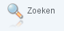

    te klikken vanuit het hoodscherm;

1.  Je komt nu eerst in het zoekscherm Personen;

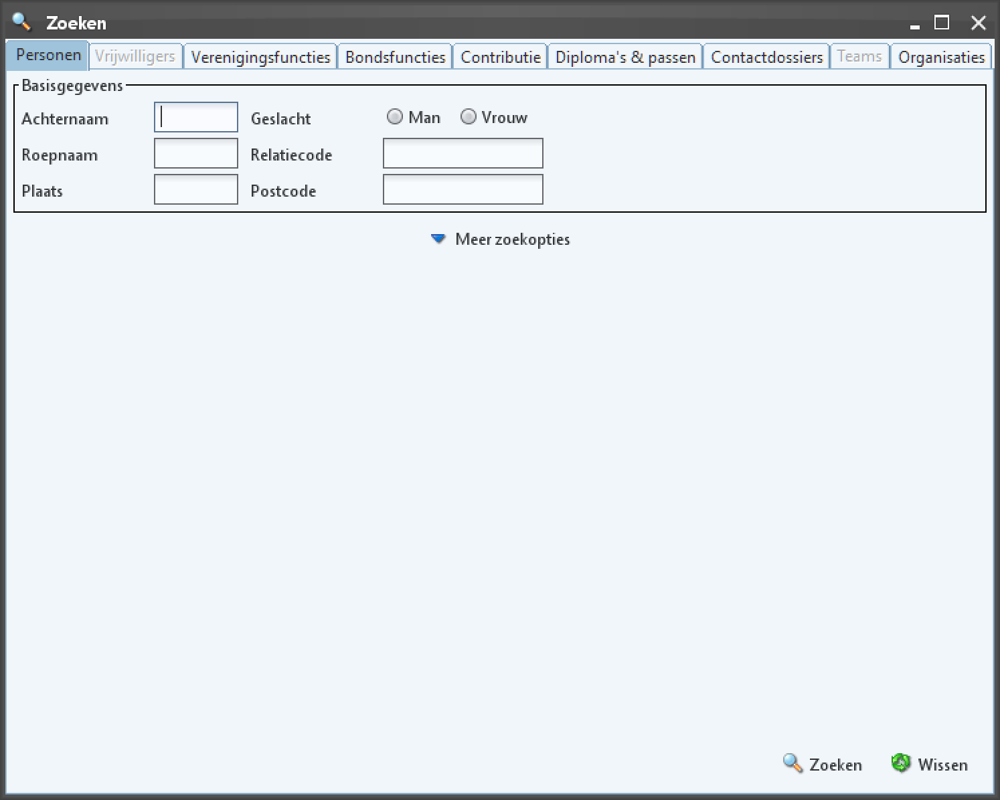

### Leden gegevens

1.  Gebruik in het zoekscherm het tabblad “Personen” en klik op zoeken.

   Hier gaan we de leden exporteren. Selecteer “Meer zoekopties”;

   Selecteer Leden onder Soort persoon en klik op zoeken.

1.  Het scherm gevonden leden opend zich nu met alle huidige leden.  
    Onderaan dit scherm zitten de volgende knoppen:

Gebruik 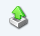 om de gegevens te exporteren ná kolom selectie;

1.  Het keuze scherm met de export opties opend zich nu;

Vul de lijst rechts met de gegevens uit de linker kolom volgens bovenstaande
volgorde.

*De volgende kolom mag NOOIT geexporteerd worden:*

-   BSN  
    Bij wet verboden te registreren, laat staan export/import handelingen.

-   Volledige naam (1)  
    Maakt de export bestanden stuk door de wijze waarop het systeem dit veld
    samensteld.

1.  Klik op Verder en kies hier voor exporteren als Puntkomma *zonder*
    kolomnamen.

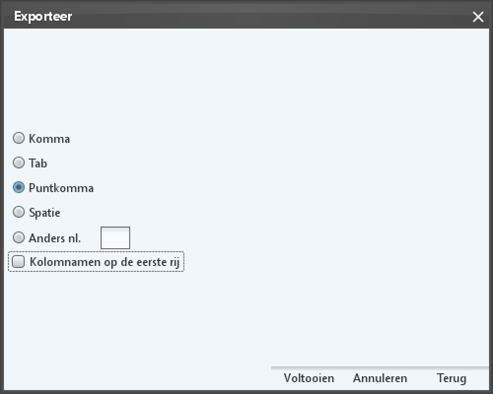

1.  Klik op Voltooien en sla het bestand op een veilige en binnen de vereniging
    afgesproken locatie op als “leden.csv”. Let op: het export bestand bevat
    privacy gevoelige gegevens welke enkel binnen de ledenadministratie en
    Club.Redders mogen bestaan. De export is enkel noodzakelijk voor het
    overzetten/koppelen van de data. Verwijder na het importeren van deze data
    binnen Club.Redders altijd deze export bestanden. Club.Redders maakt daarna
    automatisch een backup van deze data.

#### Inrichtings eisen diff functie

Om leden en hun gegevens te vergelijken tussen Club.Redders en Sportlink dient het tabblad “Persoon” in Sportlink ingericht te zijn volgens onderstaande instructies.
De diff functie matcht op een exacte overeenkomst van deze gegevens.

**Let op: géén enkel veld in SportLink mag een komma , of puntkomma ;
bevatten.**  
Bij het gebruik van deze tekens kan data niet correct geëxporteerd worden.
Sportlink controleerd hier echter niet op!

Voor de vergelijkingsfunctie zijn de volgende tabbladen voor persoonen nodig;

- Persoon
- Sport
- Verenigingsfuncties
- Bondsfuncties

#### Inzet van velden bij het tabblad persoon

Het tabblad Persoon bestaat uit 5 secties;

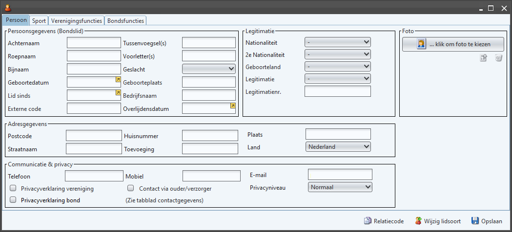

Persoonsgegevens:

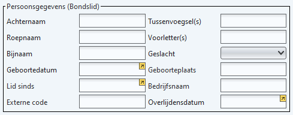

   Hierbij zijn de velden als volgt;

-   Achternaam, Tussenvoegsel, Roepnaam en Voorletter(s).  
    Voor deze velden geld dat alleen het veld Tussenvoegsel optioneel is de rest
    is verplicht.  
    Achternaam is bij een dubbele achternaam gescheiden door een "-" zonder
    spaties.
    Voorletter(s) zijn alle hoofdletters gescheiden en eindigend op een ".".

-   Geslacht, is ingevuld volgens de dropdown opties en Geboorteplaats in
    hoofdletters.

-   Geboortedatum en lid sinds.  
    Deze zijn binnen Sportlink afgedwongen in het formaat dd-mnd-yyyy.

-   Bijnaam, Bedrijfsnaam, Externe code en Overlijdensdatum.  
    Deze velden worden niet gebruikt en zijn leeg.

Adresgegevens:

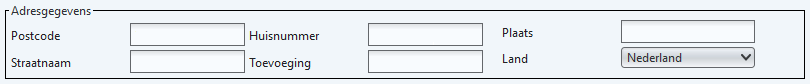

Hierbij zijn de velden als volgt;

-   Postcode, Huisnummer, Plaats, Straatnaam, Toevoeging en Land.
    Voor deze velden geld dat alleen het veld Toevoeging optioneel is de rest is verplicht.  
    Postcode bestaat uit vier cijfers, gevolgd door een spatie en daarna twee hoofdletters.  
    Plaats is volledig in hoofdletters.

Communicatie & privacy:

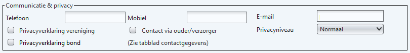

Hierbij zijn de velden als volgt;

-   Telefoon, mobiel en E-mail. Deze drie velden zijn optioneel en zijn niet
    opgenomen in het HR als te delen gegevens. Ga hier dus voorzichtig mee om.
    Indien ze wel ingezet worden doe dit dan als volgt (gezien Sportlink zelf
    geen formaat afdwingt);  
    Telefoon nummers altijd volgens Nederlandse notatie opnemen,  
    Bij een 3 cijferig net nummer 123 456 78 90 en bij 4 cijfers 1234 56 78 90.  
    Mobiele nummers eveneens maar die notatie is daarbij altijd 06 34 56 78 90.  
    E-mail adressen dienen altijd in kleine letters (lower case) toegevoegd te worden.

-   Privacyniveau. Wordt niet actief gebruikt, de standaard waarde is normaal.  
    De volgende opties zijn beschikbaar en betekenen volgens Sportlink het
    volgende;

    -   Privé, bedoeld voor mensen die zo min mogelijk gegevens willen delen. In
        het algemeen geldt dat de persoon als Anoniem wordt getoond en niet is
        te vinden bij zoekopdrachten.

    -   Normaal, bedoeld voor de "gemiddelde" sporter. In het algemeen geldt dat
        persoon wel wordt getoond, maar gegevens (zoals foto) beperkt zichtbaar
        zijn.

    -   Open, bedoeld voor mensen die weinig problemen hebben met het delen van
        gegevens. In het algemeen geldt dat gegevens van persoon wel worden
        getoond.

-   Overige vinkjes.  
    Worden momenteel niet gebruikt en zijn bij iedereen leeg.

Legitimatie:

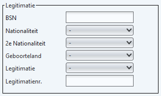

Hierbij zijn de velden als volgt;

-   BSN.  
    **MAG ZEKER NIET WORDEN GEVULD.**

-   Nationaliteit, Geboorteland, Legitimatie en Legitimatienr.
    Mogen eveneens niet worden verzameld conform HR/VO en kunnen door ons ook niet in Sportlink worden opgenomen gezien deze daarna meteen met derde gedeeld worden.

Foto:

Hierbij is het veld als volgt;

-   Foto.  
    **Mag niet worden gevuld**, bevat mogelijk foto’s als een andere brigade deze toegevoegd. Het toevoegen van foto’s betekend dat deze automatisch met andere brigade’s en de bond gedeeld worden. Dit is in strijd met de AVG. Indien foto’s beschikbaar dienen te zijn binnen de vereniging, gebruik dan de Club.Redders pasfoto module.

### Bondsdiploma’s

1.  Gebruik in het zoekscherm het tabblad “Diploma’s & Passen” en klik op
    zoeken.

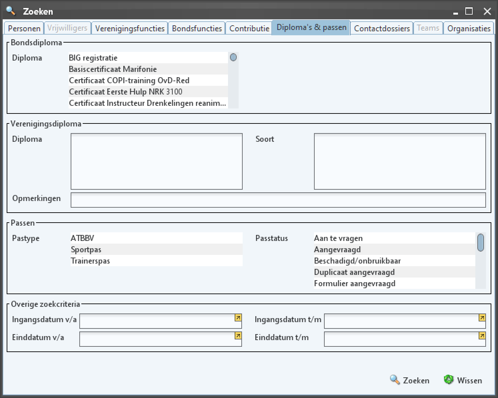

1.  Het scherm gevonden personen opend zich nu met alle huidige leden.  
    Onderaan dit scherm zitten de volgende knoppen:

   Gebruik

   om de gegevens te exporteren ná kolom selectie;

1.  Het keuze scherm met de export opties opend zich nu;

   Vul de lijst rechts met de volgende gegevens uit de linker kolom op
   volgorde;

-   Relatiecode

-   Bond/Club

-   Diploma/pas

-   Soort/categorie

-   Ingangsdatum pas

-   Einddatum pas

-   Bijscholing

-   Opmerkingen

1.  Klik op Verder en kies hier voor exporteren als Puntkomma *zonder*
    kolomnamen.

1.  Klik op Voltooien en sla het bestand op een veilige en binnen de vereniging
    afgesproken locatie op als “diplomas.csv”. Let op: het export bestand bevat
    privacy gevoelige gegevens welke enkel binnen de ledenadministratie en
    Club.Redders mogen bestaan. De export is enkel noodzakelijk voor het
    overzetten/koppelen van de data. Verwijder na het importeren van deze data
    binnen Club.Redders altijd deze export bestanden. Club.Redders maakt daarna
    automatisch een backup van deze data.

### Bondsfuncties

1.  Gebruik in het zoekscherm het tabblad “Bondsfuncties”.

   Selecteer hier alle Official en Functie opties en klik op zoeken.

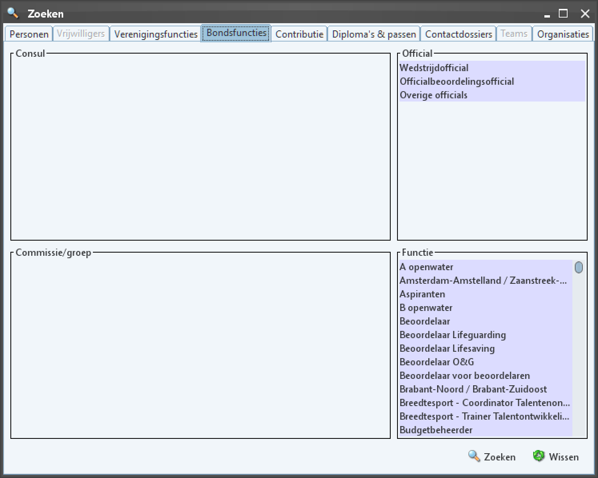

1.  Het scherm gevonden personen opend zich nu met alle huidige leden.  
    Onderaan dit scherm zitten de volgende knoppen:

   Gebruik

   om de gegevens te exporteren ná kolom selectie;

1.  Het keuze scherm met de kolom opties opend zich nu;

   Vul de lijst rechts met de volgende gegevens uit de linker kolom op
   volgorde;

-   Relatiecode

-   Functie

1.  Klik op Verder en kies hier voor exporteren als Puntkomma *zonder*
    kolomnamen.

1.  Klik op Voltooien en sla het bestand op een veilige en binnen de vereniging
    afgesproken locatie op als “functies.csv”. Let op: het export bestand bevat
    privacy gevoelige gegevens welke enkel binnen de ledenadministratie en
    Club.Redders mogen bestaan. De export is enkel noodzakelijk voor het
    overzetten/koppelen van de data. Verwijder na het importeren van deze data
    binnen Club.Redders altijd deze export bestanden. Club.Redders maakt daarna
    automatisch een backup van deze data.

### Activiteiten gegevens

1.  Gebruik in het zoekscherm het tabblad “Activiteiten” en klik op zoeken.

1.  Het scherm gevonden personen opend zich nu met alle huidige leden.  
    Onderaan dit scherm zitten de volgende knoppen:

   Gebruik

   om de gegevens te exporteren ná kolom selectie;

1.  Het keuze scherm met de kolom opties opend zich nu;

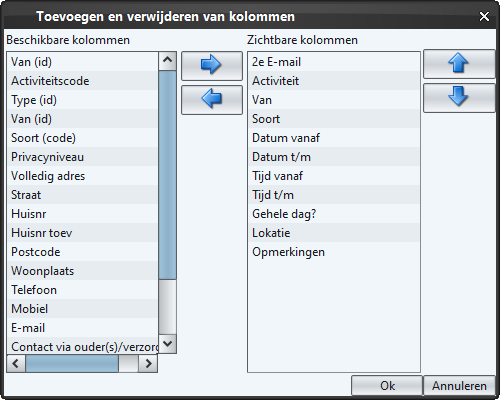

   Vul de lijst rechts met de volgende gegevens uit de linker kolom op
   volgorde;

-   2e E-mail

-   Activiteit

-   Van

-   Soort

-   Datum vanaf

-   Datum t/m

-   Tijd vanaf

-   Tijd t/m

-   Gehele dag?

-   Lokatie

-   Opmerkingen

1.  Klik op Verder en kies hier voor exporteren als Puntkomma *zonder*
    kolomnamen.

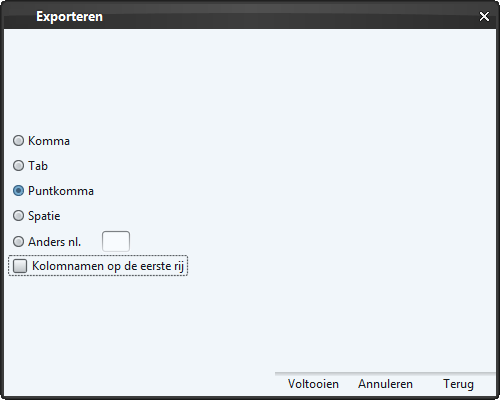

1.  Klik op Voltooien en sla het bestand op een veilige en binnen de vereniging
    afgesproken locatie op als “activiteiten.csv”. Let op: het export bestand
    bevat privacy gevoelige gegevens welke enkel binnen de ledenadministratie en
    Club.Redders mogen bestaan. De export is enkel noodzakelijk voor het
    overzetten/koppelen van de data. Verwijder na het importeren van deze data
    binnen Club.Redders altijd deze export bestanden. Club.Redders maakt daarna
    automatisch een backup van deze data.

