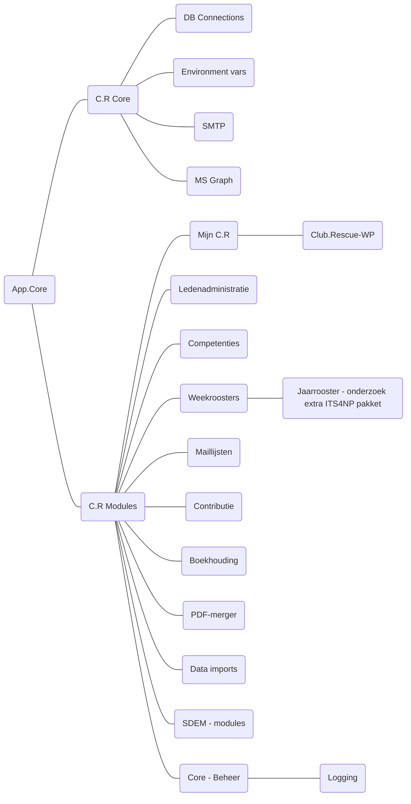
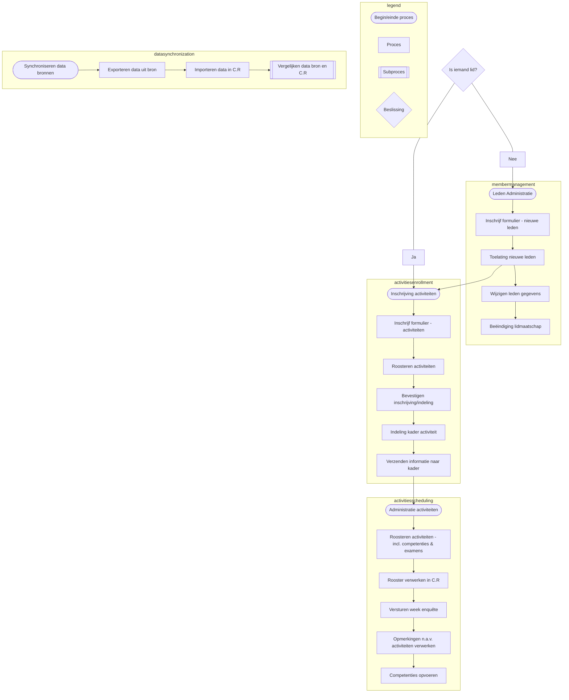

# Club.Redders & externe systemen

## App.Core

| | |
| --- | --- |
| Functionaliteiten | - Alle functionaliteiten die niet worden ondersteund door reeds beschikbare software. |
| Afhankelijkheden | - Office 365 - MachForm - WordPress (indien gebruik wordt gemaakt van de plugin) |
| Architectuur | Core developer(s) |

- Core componenten
    - Generieke technische functionaliteiten
    - Bruikbaar in alle modules
    - Gedeeltes van modules kunnen t.z.t. overgaan naar de core
- Modules
    - Bevatten één enkele functionaliteit
    - Kunnen los van elkaar en de core ontwikkeld worden
    - Maken geen gebruik van andere modules
        - M.u.v. de jaarrooster module (afhankelijk van competenties module)

## Club.Redders

|  ||
| --- | --- |
| Werkt - getest | - Vimexx. |
| Werkt - niet getest | - TransIP. - Hostnet. |
| Werkt niet - getest | - PCextreme. |

- Software eisen;
    - SSL-certificaten (met auto renewal), SFTP, SSH, MariaDB, .htaccess, PHP 7.4 of hoger.
- Taken/kennis eisen IT functionaris;
    - Git, PHP, SQL, HTML, JS, Apache, MariaDB, phpMyAdmin, MVC principes, SSH, Microsoft Graph.
    - Couldhaves; ervaring met WordPress Plugin Development.

## Externe systemen

|  ||
| --- | --- |
| Werkt - getest | - Sportlink. - Rabobank CSV. |
| Werkt - niet getest | - Rabobank MT940. |
| Werkt niet - getest | - Geen producten bekend. |

- Software eisen extern ledenadministratie pakket;
    - CSV export van leden met attributen.
    - CSV export van bondsfuncties met attributen.
    - CSV export van bondsdiploma’s met attributen.
- Software eisen internetbankieren;
    - CSV export vantransactiesmetattributen.
    - MT940 export vantransactiesmetattributen.
- Taken/kennis eisen IT functionaris;
    - Het beheer van externe systemen valt buiten de scope t.a.v. het takenpakket en kennis vereiste van IT functionarissen.
- Advies: houd domeinregistratie en webhosting gescheiden tussen bestuur en IT functionarissen.
    - Zorg dat toegang van MFA is voorzien en bij voorkeur ook van persoonlijke accounts.

# App.Modules

# Procesflow

