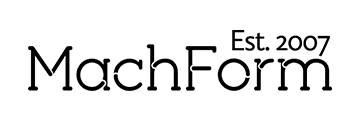

# Form (WYSIWYG) tooling

|  ||
| --- | --- |
| Werkt - getest | - MachForm. |
| Werkt - niet getest | - OhMyForm. - Orbeon Forms. |
| Werkt niet - getest | - Geen producten bekend. |

- Software eisen;
    - Huidige features die worden ingezet uit MachForm dienen ook aanwezig te zijn in een eventueel in te zetten alternatief.
- Taken/kennis eisen IT functionaris;
    - Installatie en updates van PHP software pakketten op een webserver.
    - Apache, MariaDB, phpMyAdmin.

## Docs

The ITS4NP currently supports the following forms tooling:  

[MachForm](machform){: .md-button .md-button--primary }