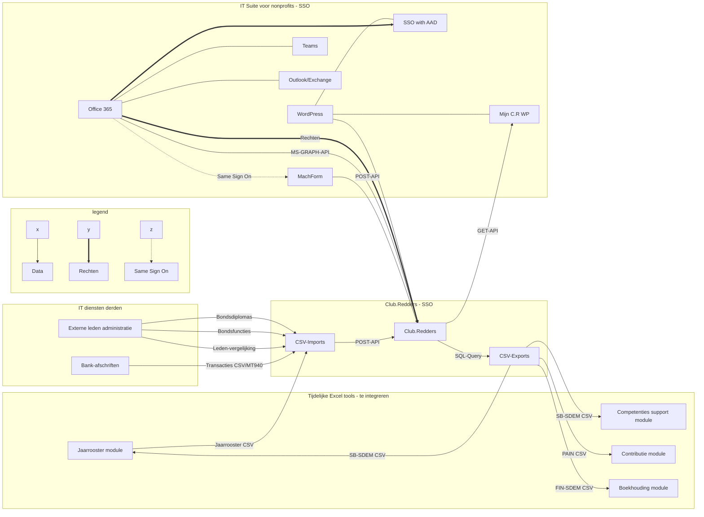

# IT Suite for non profits

## Components

```mermaid
graph LR;
    subgraph legend;
    x --> x2[Data];
    y ==> y2[Rechten];
    z -.-> z2[Same Sign On];
	end;
    
    subgraph Tijdelijke Excel tools - te integreren;
    g1[Jaarrooster module];
    h1[Competenties support module];
    i1[Contributie module];
    j1[Boekhouding module];
    end;

    subgraph IT diensten derden;
    e1[Externe leden administratie];
    f1[Bank-afschriften];
    end;

    subgraph Club.Redders - SSO;
    d1[Club.Redders];
    d2[CSV-Imports];
    d3[CSV-Exports];
    end;

    subgraph IT Suite voor nonprofits - SSO;
    a1[WordPress];
    a2[SSO with AAD];
    a3[Mijn C.R WP];
    b1[Office 365];
    b2[Teams];
    b3[Outlook/Exchange];
    c1[MachForm];
    end;

    d1 --GET-API--> a3;
    a1 --> d1;
    b1 ==Rechten==> d1;
    b1 --MS-GRAPH-API--> d1;
    c1 --POST-API--> d1;

    g1 --Jaarrooster CSV--> d2;
    d3 --SB-SDEM CSV--> g1;
    d3 --SB-SDEM CSV--> h1;
    d3 --PAIN CSV--> i1;
    d3 --FIN-SDEM CSV--> j1;

    e1 --Bondsdiplomas--> d2;
    e1 --Bondsfuncties--> d2;
    e1 --Leden-vergelijking--> d2;
    f1 --Transacties CSV/MT940--> d2;

    d1 --SQL-Query--> d3;
    d2 --POST-API--> d1;

    a1 --- a2;
    a1 --- a3;
    b1 ===> a2;
    b1 --- b2;
    b1 --- b3;
    b1 -.Same Sign On.-> c1;
```
<!--a1 ===> d1;-->