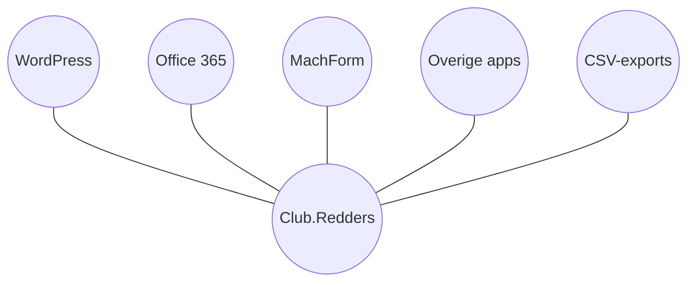
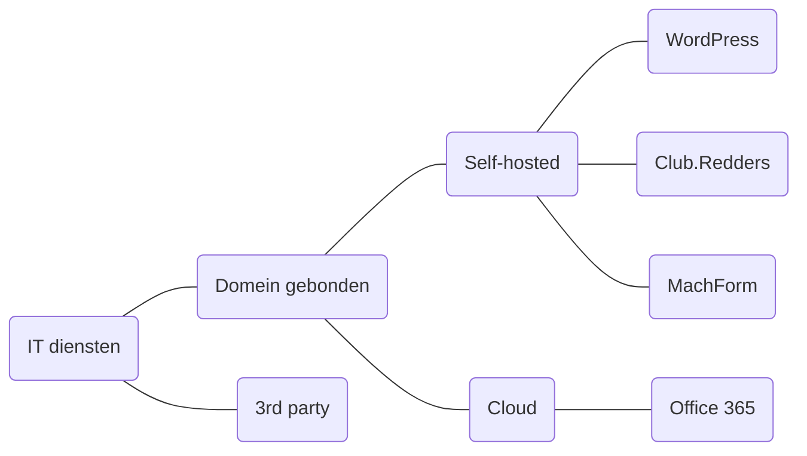
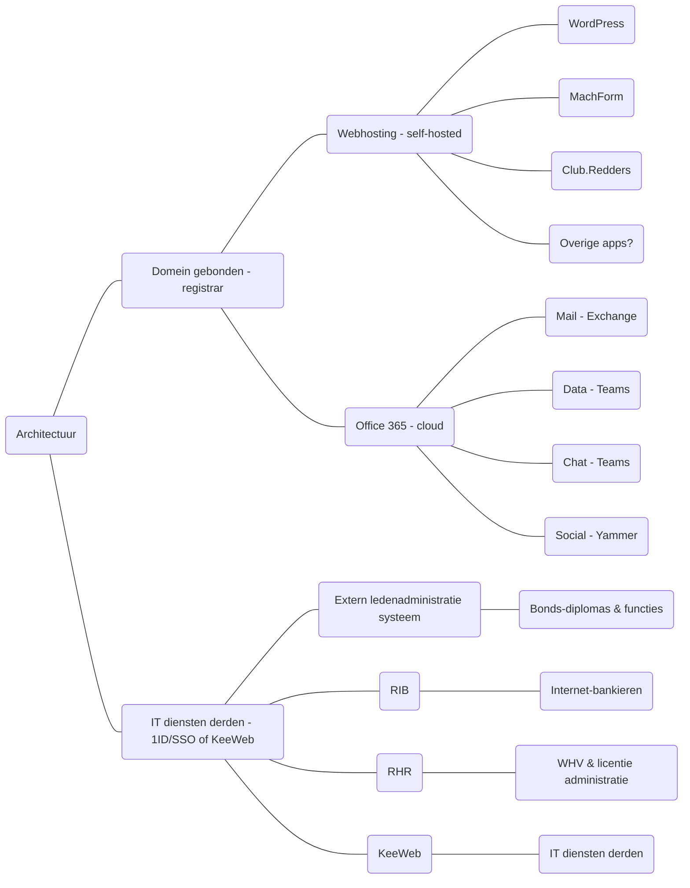
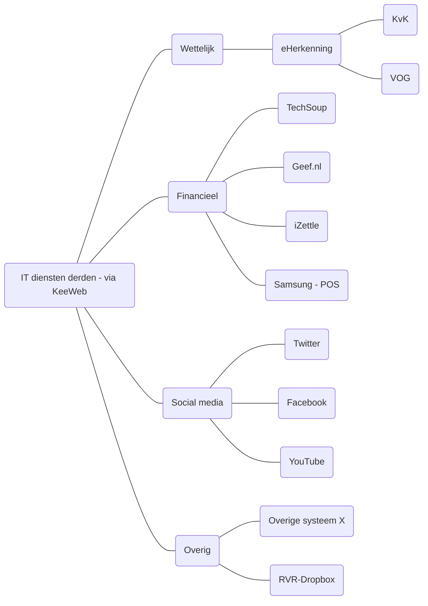

# IT Suite for non profits

## High level view

| | | Product |
| --- | --- | --- |
|  | NONPROFIT SUPPORT TOOLING Modulaire open source app voor maatwerk functionaliteiten |  |
|  | COLLABORATION SUITE & SSO IdP Één account voor toegang tot interne en externe diensten |  |
|  | FORM (WYSIWYG) EDITOR Bouw eenvoudig veilige en versleutelde formulieren met procesflows |  |
|  | SITE (WYSIWYG) EDITOR Bouw en beheer eenvoudig je website en haar content |  |
| | |  |

## IT Suite | IT services

## Internal and external IT components

## IT services third parties | through KeeWeb

